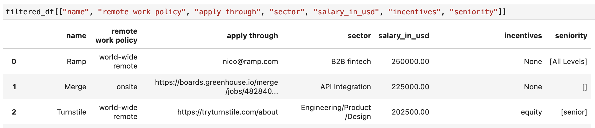

# Extract structured data from HN job threads 

Extract structured data from free text in Hacker News [who is hiring monthly threads](https://news.ycombinator.com/item?id=35424807), using HN and OpenAI APIs.

_The structured output will look like:_



Usage:
```bash
# HN item id of latest hiring thread
export THREAD_ID="35424807"

# Fetch comments from HN api
./get_comments.sh "$THREAD_ID"

# Set your OpenAI API key
export OPENAI_API_KEY="..."

# Process each comments, will save to output.jsonl
# Cost about $0.50 for 350 comments (size of latest HN thread)
# Take about 30s
./process.py "comments_$THREAD_ID.json" [--output output.jsonl] [--max-parallel-requests 64]
```

Dependencies: `jq`, `openai`, `tqdm`
```bash
[[ $(uname) == "Darwin" ]] && brew install jq || apt install jq
python3 -m pip install -U openai tqdm
```

### Post-processing

Example of post-processing, extract all salaries and convert from source currency to USD:
```python
from pathlib import Path
import json
import urllib.request
import pandas as pd

raw = [json.loads(x) for x in Path("output.jsonl").read_text().splitlines()]

# Get the first role for all comment with roles listed
df = pd.DataFrame([
    (
        x["model_output"] | x["model_output"]["roles"][0]
    ) for x in raw if (
        x["status"] == "OK" and len(x["model_output"]["roles"]) > 0
    )
])

# Only keep entries with salary
df = df[~df.salary.isna()]

# Do nothing fancy, just ignore what is not numerical
df.salary = pd.to_numeric(df.salary, errors="coerce")
df = df[(~df.salary.isna()) & (df.salary > 0)]

# Get current forex rate, courtesy of https://github.com/fawazahmed0/currency-api
_f = urllib.request.urlopen("https://cdn.jsdelivr.net/gh/fawazahmed0/currency-api@1/latest/currencies/usd.json")
rates_to_usd = json.load(_f)["usd"]

# Assuming missing currency is USD
df.loc[df.currency.isna(), "currency"] = "USD"
df["currency"] = df["currency"].apply(str.lower)

# Convert
def convert_currency(x):
    if x["currency"] != "usd" and x["currency"] in rates_to_usd:
        return round(x["salary"] / rates_to_usd[x["currency"]], 2)
    return x["salary"]
df["salary_in_usd"] = df.T.apply(convert_currency)

# Show top salaries
print(df[["name", "salary_in_usd", "job_title", "locations"]].sort_values(by="salary_in_usd", ascending=False))
```
